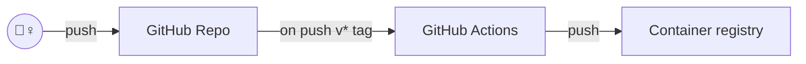
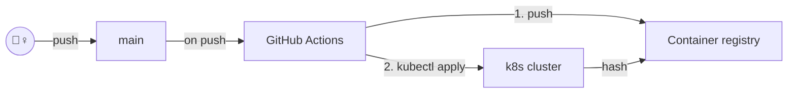
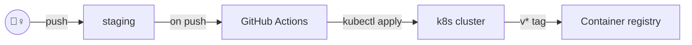
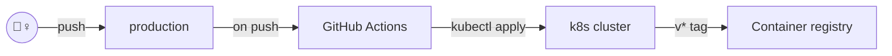

# k8s-cicd

k8s の学習を兼ねて Kubernetes で CI/CD パイプラインを実装してみる。

- GCP を使う
- プロジェクト名 `k8s-cicd`

## セットアップ

```bash
# クラスター作成
gcloud container clusters create main --addons HttpLoadBalancing,HorizontalPodAutoscaling,NetworkPolicy

# Artifact Registory にリポジトリを作成
gcloud artifacts repositories create webapp --repository-format=docker --location=asia-northeast1
```


## 終了

```bash
# クラスター削除
gcloud container clusters delete main
```


## TODO

- [ ] GCP のサービスアカウントの権限を限定する
- [ ] ワークフローの起動タイミング調整 (コンテナのビルドとデプロイの依存関係調整)
- [ ] 複数環境へのデプロイ
- [ ] EKS

## ワークフロー (案)

### リリース用コンテナビルド

- `v*` のタグがついている場合にコンテナのビルドを行いそのタグをつける
- ステージング環境とプロダクション環境で利用する



### 

### 開発環境

- `main` ブランチへの push によりコンテナのビルドと開発環境の更新を行う



### ステージング環境

- `staging` ブランチへの push によりステージング環境の更新を行う (`manifests` ディレクトリに変更がある場合のみ)



### 本番環境

- `production` ブランチへの push により本番環境の更新を行う (`manifests` ディレクトリに変更がある場合のみ)



